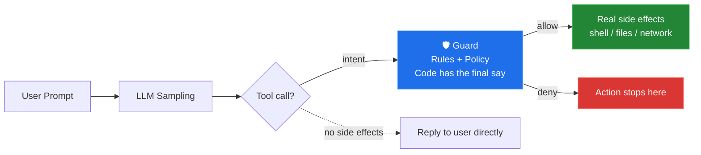
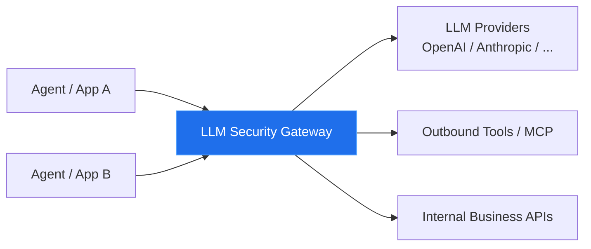
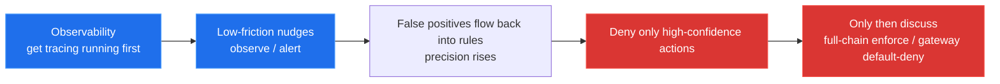

Lately I've been doing more and more AI red teaming: half the time thinking about how to attack Agents, and the other half thinking about:

once the attacks are done, what should real-world defense actually look like?

I've written a local-first Agent Runtime Guard (ARG) myself, and I've also taken apart Microsoft's newly open-sourced Agent Governance Toolkit (AGT). After taking both apart, the conclusion is actually quite clear:

**Agent runtime protection is, in essence, the "firewall" of the LLM era**. Whenever I mention "firewall"—a word that has been beaten to death—I want to laugh. Still, this is decidedly not another layer of prompt rhetoric, nor is it old IAM renamed. What it intercepts is the segment where "the model's intent has already formed, but the side effects haven't happened yet"—the command hasn't been exec'd, the keys haven't been read, the email hasn't been sent, no HTTP has left the network.

The diagram below shows the spot we need to watch: not what the LLM says internally, but the tool call it is **about to make**.



A conservative estimate: this will be the most valuable category of security problems for the next few years. Not because the concept is new, but because Agents are turning "what was said" into "what was done," while most of our existing security stack still lives in the request-response era.

---

## Why the model can't protect itself

Microsoft put it bluntly in the AGT README: prompt-level security is not a control surface—it's just a polite remark made to a stochastic system. It improves UX, but barely moves security ROI. OWASP LLM01 also states it plainly: there is no silver bullet for prompt injection. The red teaming numbers they cite are even more direct: under adaptive attacks, ASR can reach 100%.

In plain words: **you can't let a reckless intern be their own police officer.**

LLM generation is, at its core, sampling.

Today it follows the rules; tomorrow, with a different context, a different suffix optimization, or a second-order injection hidden in a web page, it may turn `summarize this article` into `curl | bash`.


Expecting a system prompt or "please ignore malicious instructions" to block this kind of thing is like handing a job that must be reliable to a component that rolls the dice through sampling.

So the shared move across existing frameworks is really the same thing—move "uncertainty" out of the model and turn it into a decidable, deterministic mechanism:

1. **Extract** actions out of natural language into structure: tool name, args, resource, actor, session.
2. Describe allows and denials with **semantic-layer rules** (YAML / JSON / Rego / Cedar).
3. **Block them dead with code before side effects happen**—allow / deny / alert / require_approval, not "model, think it over again."

AGT's original words: an action rejected by the policy kernel is not "unlikely to happen," but **structurally impossible**. ARG doesn't shout a slogan that heavy, but the path is the same: `context → action → object → decision`, where rules only produce recommendations and the policy layer decides whether to enforce.

To put it bluntly: you can't count on the model for this—whether it's reliable depends entirely on whether the layer of code around it is hard enough.

---

## Two integration routes, and they are not the same cost of retrofit

When you land this, you'll keep running into one design choice: where to hang the Guard. Conclusion first, then the details.

| | Tool Call Wrapper | LLM Security Gateway |
|---|---|---|
| Where it intercepts | In-process, before tool execution | Unified entry point of the model call chain |
| Context | Most complete (prompt + args + local machine state) | Weaker (typically prompt/API; local side effects invisible) |
| Intrusiveness | High (every tool/framework/client needs adaptation) | Low (base URL change / SDK-init-level change) |
| Endpoint coverage | Strong (can still intercept in YOLO mode) | Weak (dangerous actions may bypass the gateway) |
| Retrofit surface | Grows exponentially with language/framework count, case by case | Centralized, easy to standardize |
| My positioning | **The last mile at the action layer** | **The default shape of the enterprise backbone** |

### 1. Tool Call Wrapper

The typical form is a single line:

```python
safe_tool = govern(my_tool, policy="policy.yaml")
```

Or hook a `PreToolUse` Hook on endpoint runtimes like Claude Code / Cursor; or in Electron products, funnel all shell / file / network operations into a Tool Broker in the Main Process, then into the Guard.

Its confidence comes from full context: who, intent, tool args, conversation history—all inside the process. Things that proxies and eBPF can't fully capture are naturally available here. It enables intent-action consistency checking: the user says "summarize the article," but the model wants `rm -rf`—at the dispatch point this is visible at a glance. The real risk surface of endpoint Agents (reading/writing local files, running commands, installing dependencies, poking around `~/.ssh`) should be gated exactly here.

The cost is also right there: high intrusiveness. Every tool, every framework, every client needs an adapter; miss one `run_command` that goes straight to the raw executor, and the entire rule set is decoration. In multi-language, multi-framework scenarios the retrofit surface grows exponentially—AGT piling up 5-language SDKs and roughly 20 framework adapters is precisely paying this bill.

### 2. LLM Security Gateway

To put it plainly, this is installing a "unified checkpoint" for all LLM traffic. No matter which Agent, application, or tenant sends it—as long as it wants to call a model, go outbound, or cross tenants—it all squeezes through this one gate first: check policy, record audit, de-sensitize, rate-limit, and only then let it through downstream.



In to-B business this thing sells well, because it looks like the API gateway / zero-trust entry everyone already has—organizations have muscle memory for it: business teams barely change code, at most swapping a base URL; policies, auditing, and tenant boundaries can be operated centrally in one place, and both procurement and ops recognize it.

But the gateway is no silver bullet. It can usually see prompts and API calls, but not necessarily the local shell, local files, MCP subprocesses, or that real `exec` inside Electron. Under endpoint YOLO mode (`bypassPermissions` / `dontAsk`), dangerous actions may never pass through your central gateway at all. There's also an old problem—a centralized failure becomes downtime for everyone, which directly fights against "security components must not be a SPOF."

So I'll just state my judgment:

> In the medium-to-long term, **the LLM security gateway is the best default form at enterprise scale**—low retrofit cost, clear operational surface, suited to standardization.
>
> But the real side effects of endpoint Agents still need the Tool Call / Hook / Tool Broker layer as a backstop. **The gateway governs the "model boundary"; the wrapper governs the "action boundary."** The two are not an either-or choice—they are a division of labor over different blast radii.

ARG prioritizes endpoint Hooks and the Tool Broker, not because the gateway doesn't matter, but because `npm install` on a developer's machine, reading `.env`, or hitting the metadata endpoint can often slip around central policy. AGT leans more toward enterprise application middleware: `govern()`, policy engine, identity, Merkle auditing, sandboxing—a whole set of "structurally impossible to do evil."

Same layer of problem, two product philosophies. Both are right—it depends which layer you're on.

---

## For enterprise rollout, the technical route isn't the first priority

Engineers can argue for a long time about which is more elegant technically. But in production rollout, what kills a proposal first is usually not false negatives—it's **noise and experience**.

When I previously did security evangelism on the R&D side of SDL, I summarized a discipline that leaves almost no room for negotiation:

1. **Experience first, correctness second.** Only when developers are willing to use it do the rules earn the right to get stricter.
2. **There must be a degradation path.** dry-run, observe, one-click rollback. (The security Guard itself crashes and takes the business down with it?)
3. **High TP, high precision, zero noise is the top priority.** TP here isn't a throughput slogan—it's the credibility of true positives: what's blocked is real risk, not scolding everyday development. (Five minutes writing code, half an hour dealing with code alerts?)
4. **Prove it first, then roll out.** Manually verify every hit in 1–2 repos; if precision doesn't meet the bar, no org-wide enforce.

ARG bakes this into product behavior: detection and enforcement are decoupled; observe by default; `--observe` gives one-click global rollback; allowlists degrade per rule/app/environment; fail-open—on rule exceptions or timeouts, allow through and record it. AGT takes the opposite road: fail-closed, treating policy exceptions as deny; its ADR even states in black and white that there is no fail-open switch—sexy on strongly compliant, strongly isolated server sides, but on endpoint developer machines it easily pushes people to uninstall the Guard.

And after uninstalling? Running naked. Worse than "a pure observe mode with the occasional false positive."

So for enterprise rollout, I recommend fixing the order like this—no skipping steps:



Put plainly, one sentence: **without high precision, there is no right to enforce.** If the security team goes fail-closed and blocks everything from day one, it looks brave—but three weeks later, all that's left is bypasses and complaint tickets.

---

## A few things I confirmed from the two implementations

### The control plane sits before side effects, not inside the prompt

Whether AGT's `govern()` or ARG's `PreToolUse` / Tool Broker, the checkpoint is the same: the model has decided to call a tool, but the tool hasn't produced real impact yet. Second-order prompt injection especially: instructions hidden in product details, web pages, emails, and attachments must ultimately land as a tool call. Shouting "please ignore" in the prompt is useless; making one decision in front of the dispatcher works.

### Policy as code exists to turn uncertainty into something testable

JSON/YAML rules, hot reloading, bench replay of labeled samples, precision/recall/latency—these look unglamorous, but they're the only things that can enter an enterprise change process. Model output isn't reproducible; rule hits are. Only what's reproducible can be audited, can be canary-rolled, and lets you point at a false positive and say "it's this `rule_id` acting up."

### Tracing-first is often worth more than "block first, ask later"

Many incidents aren't "we failed to block" but "we can't explain who did it, in what context." A `trace_id` stringing together context → action → object → decision supports incident response and postmortems far better than a cold deny log. ARG treats this as the first principle; AGT uses a Merkle chain and signed TRACE, turning audit into verifiable evidence. Different depths, same direction: without an execution chain, runtime protection is just a black-box switch.

### The philosophical split is worth keeping—no need to force unification

| | ARG Route | AGT Route |
|---|---|---|
| Default posture | fail-open, observe first | fail-closed, deny by default |
| Deployment focus | Endpoint, zero-dependency, local closed loop | Enterprise multi-language, identity, sandbox, compliance mapping |
| Selling point | Gradual rollout without downtime | Structurally impossible to do evil |
| Risk | False-negative window | False positives forcing abandonment |

I lean toward ARG's side for **endpoints and early rollout**—security components must not be a single point of failure. For **strongly isolated production Agents and highly compliant tenants**, AGT's fail-closed + identity + audit chain holds up better. The common correct answer in enterprises is actually layering: gateways and critical production chains lean strict, while developer machines and pilot phases lean observational.

---

## So what would you do

If you're building an Agent product or an enterprise Agent platform, three things rank highest in priority:

1. **First converge actions into an interceptable boundary.** Don't let model output go straight into raw shell / file / network executors. Without a unified dispatcher, every policy afterward is theater.
2. **Split rules from enforcement.** Rules recommend; policy decides whether to enforce; it must support dry-run, must be able to quantify precision, must be able to degrade with one click.
3. **Choose the integration form by scenario, not by slogan.** For unified enterprise entry points, prioritize the LLM security gateway; for endpoint local Agents, Electron tools, and YOLO mode, honestly do Tool Call wrapping or Hooks. The gateway is the future backbone; the wrapper is the last mile at the action layer.

Will Agent runtime protection get talked to death in the short term? Yes. Does that make it unimportant? No.

The firewall back then didn't win because "the concept was elegant"—it won because traffic was no longer under the application's own control, and a gate capable of blocking had to grow at the boundary. Today's Agents have simply pushed the boundary from IP/port to the tool call and the model gateway.

The gate will grow out of these two layers. Those who acknowledge this early pay a bit less tuition.

---

## Appendix: Two Expandable Technical Walkthroughs

The main text only covers judgments. If you want to check against implementation details, the two standalone HTML files below can be expanded for preview inline, or opened as full pages on their own.

### Appendix A · Microsoft AGT

- Standalone page: [Open the AGT walkthrough](/appendices/agent-runtime/AGT_讲解.html)
- Contents: the `govern()` interception point, fail-closed, policy/identity/sandbox/audit, OWASP mapping and boundaries

<details>
<summary><strong>Expand on this page · AGT walkthrough</strong> (loads the full HTML; if heavy, use the link above)</summary>

<div style="margin:12px 0 4px;border:1px solid var(--border, rgba(0,0,0,.12));border-radius:10px;overflow:hidden">
<iframe src="/appendices/agent-runtime/AGT_讲解.html" title="Microsoft Agent Governance Toolkit technical walkthrough" loading="lazy" style="width:100%;height:min(78vh,820px);border:0;display:block;background:#0d1117"></iframe>
</div>

</details>

### Appendix B · Self-built ARG

- Standalone page: [Open the ARG walkthrough](/appendices/agent-runtime/ARG_讲解.html)
- Contents: event chain, fail-open gradual rollout, rule/policy decoupling, endpoint Hook / Tool Broker, and comparison with AGT

<details>
<summary><strong>Expand on this page · ARG walkthrough</strong> (loads the full HTML; if heavy, use the link above)</summary>

<div style="margin:12px 0 4px;border:1px solid var(--border, rgba(0,0,0,.12));border-radius:10px;overflow:hidden">
<iframe src="/appendices/agent-runtime/ARG_讲解.html" title="Agent Runtime Guard technical walkthrough" loading="lazy" style="width:100%;height:min(78vh,820px);border:0;display:block;background:#0d1117"></iframe>
</div>

</details>
