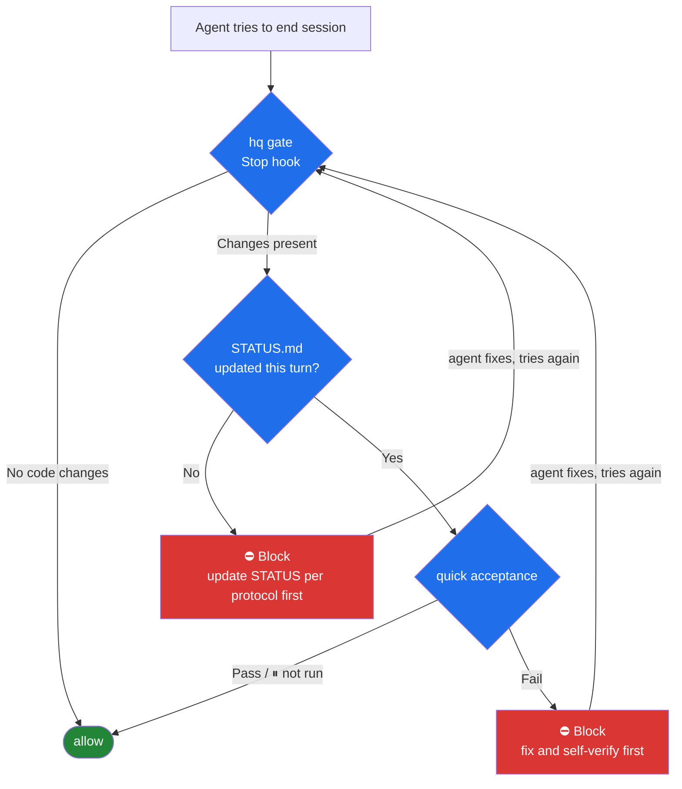

I scrolled back through months of conversations with my coding agents, and one finding stung:

I had sent "go on" dozens of times — not because the work was done, but because the agent had stopped.

And "review this as an expert" / "try harder" — dozens more. Not because the agents weren't capable. Because nothing existed that could prove their work.

I'm using the best models money can buy. And my management style was: whenever I get a spare minute, check whether they're slacking off.

That's absurd. The problem was never the model. It's that there was no protocol between the model and the project. "I'm done" is an empty sentence until something verifies it; I should have been handling only the decisions that genuinely need a human, but in practice I was a full-time supervisor.

So I built [hq](https://github.com/hi-unc1e/hq) — a cross-project terminal dashboard plus an acceptance scaffold for AI agent work. Python 3.11+, zero third-party dependencies, MIT, open-sourced today.

Locally, I've hooked every project I have in flight into it. Morning and evening briefs are generated by scheduled tasks, and it feels… right. This post covers three things: the problems it solves, what the protocol looks like, and my favorite part — the Stop gate.

First, the pain, made concrete. Once you run several projects and a dozen parallel sessions, the problems are embarrassingly clear:

- **Claiming done ≠ done**: the agent reports beautifully, but whether the tests are actually green, nobody knows
- **Decisions evaporate**: this session settled "no multi-user support", and three days later another session asks about it again
- **Review overhead explodes**: you can't tell what actually waits on you versus what the agent could push forward on its own
- **No gate at wrap-up**: the moment a session ends, nothing remains — no verification, no trace, no follow-up

These four share one property: they should be solved by mechanism, not by my diligence.

## The protocol: three files

hq doesn't inject a framework into your project. Every onboarded project carries exactly three Markdown files, and they form the entire interface between the agent and you:

| File | Who writes it | What it does |
|---|---|---|
| STATUS.md | agent | one-line state, ❓ items awaiting your judgment, ⛔ blockers, ▶ next steps |
| ACCEPTANCE.md | you + agent | the definition of done + machine checks (quick / full tiers) |
| DECISIONS.md | agent, on your behalf | trade-offs you've confirmed, so the same question never gets re-asked |

The core idea in one sentence: **whatever machines can prove, machines prove**. Tests, fingerprints, re-runs — all become check commands in ACCEPTANCE; only judgments machines can't verify — aesthetics, trade-offs, authorization — get escalated to you as ❓.

The quick/full split was taught to me by reality: quick stays under a minute and runs at every wrap-up; builds, e2e, and full suites go to full, reserved for milestones. There's also the case where a check can't run due to external conditions (quota, account, device) — the script exits with `exit 3`, meaning "⏸ not run" — neither pass nor fail. Forcing that into black-and-white only teaches people to ignore acceptance results.

And here is what a machine check looks like in practice (real output; quick tier, 1.7s total; paths redacted):


*`hq verify --tier quick`: lint ✅ 0.1s + signal contracts ✅ 1.6s, 2/2 passed*

## Reviewing and answering: five commands

The CLI keeps exactly five human commands; machine commands live in a separate group under `--help` and stay out of daily view.

The real board looks like this — one line per project, so everything waiting on your judgment is a single glance away (other projects anonymized):


*Live board (local screenshot, other projects anonymized; terminal text in Chinese — columns read: name, state, ❓/⛔/✅ counts, one-line summary)*

Review — standing inside a project, you see just that project (demo below uses the fictional project demo-api, data simulated):

```bash
$ cd ~/code/demo-api && hq todo
❓ demo-api#1  Should error responses include a request_id
❓ demo-api#2  404 page: illustrations library or plain text
```

Drill into one item. An agent must spell out three things — how to verify / expected outcome / recommendation — before an item is allowed into the ❓ queue:

```bash
$ hq todo 1
❓ demo-api#1 · Should error responses include a request_id   [pending]
   demo-api (tool · personal) · updated 2026-09-27 10:00
   State: v0.3 cache layer shipped, P95 down from 810ms to 240ms; 404 page not done yet.

   How to verify: look at a v0.3 error example and judge whether it truly helps debugging
   Expected: users reporting issues get an immediate locator clue
   Recommendation: do it, half a line of code

   File: /code/demo-api/STATUS.md (❓ around line 15)
   Answer: hq ok 1   or   hq note 1 "your opinion"
```

Answering is one command; it writes back to the file, and the agent digests it next turn:

```bash
$ hq ok 1
✅ - [x] **Should error responses include a request_id** — how to verify: look at a v0.3 error example …
$ hq note 2 "use the illustrations library, but only for the 404 page, lazy-loaded"
💬 - [ ] **404 page: illustrations library or plain text** — … → Henry: use the illustrations library, but only for the 404 page, lazy-loaded
$ hq todo
No items awaiting your judgment. (--all to see every project)
```

`hq status` shows one line per project for the full picture; `hq brief` generates a morning/evening report — pending judgments, acceptance anomalies, idle alerts, one section each. The brief itself is Markdown: tick checkboxes in your editor, append "— your opinion" to an item, and it gets written back to STATUS before the next generation. I run two scheduled tasks myself — 06:06 and 21:05. Since then, the question "what's the state of my projects today" has never been asked manually again.

## The Stop gate: agents prove their work before clocking out

This is my favorite part of the whole project.

Both Claude Code and Codex support Stop hooks: every time an agent tries to end its turn, the hook receives a JSON payload with session context, and may block it — with a reason. hq gate sits exactly there:



The rules, in plain language:

1. Code changed but STATUS not updated → blocked. The reason is written into the block message: bump the `updated` field in front matter, give a one-line state (the outcome, not the process), and keep ❓ items to things machines can't verify;
2. quick acceptance failed → blocked, with the tail of the check output and the log path attached;
3. At most two blocks per turn — from the third attempt on, the gate lets the session through and records `gave-up` in the event log (`<project>/.hq/gate.log`). Preventing infinite loops outranks preventing slacking.

And one design decision I consider the most important: **the gate is fail-open**. If hq itself crashes, times out, or hits a broken environment, it always lets you through. An acceptance tool must not become the new single point of failure — it's a gate, not a prison door.

A real block-and-release captured on my machine (the agent's second attempt, after updating STATUS per the protocol, goes through; paths redacted):


*block with the protocol reason → remediation → `{}` allowed*

The result is exactly the division of labor I wanted: an agent trying to wrap up with unverified changes gets bounced back by the machine; what it can prove, it proves itself; what it can't, it leaves as a ❓ for me. And I only ever handle the ❓s.

## Boundaries, and the honest part

- hq is designed for **one person, multiple projects** (five or fewer recommended). Multi-reviewer approval flows and team collaboration are not implemented, and not planned short-term
- The ✅ machine section is generated only by `hq verify`; handwriting it doesn't count as evidence — that's written into the protocol
- Personal data is separated from mechanism: the registry hq.toml, decisions, taste library are all gitignored; the open-source repo contains mechanism only
- The project is new. I use it daily and it works well locally, but there are surely sharp edges — issues welcome

Try it:

```bash
git clone https://github.com/hi-unc1e/hq && cd hq
cp hq.toml.example hq.toml   # register your own projects (personal data, already gitignored)
ln -s "$PWD/bin/hq" ~/bin/hq # or any PATH directory; requires Python 3.11+
hq doctor                    # self-check
```

`hq init <path>` onboards a project and automatically installs the Stop gate into `.claude/settings.json` and `.codex/hooks.json`. The full protocol lives in `protocol/PROTOCOL.md` in the repo.

The biggest change since I finished hq isn't a few dozen saved messages — it's that I finally show up only at the moments that genuinely need my judgment.

Whatever machines can prove, machines prove; what's left is what's worth my eyes.
