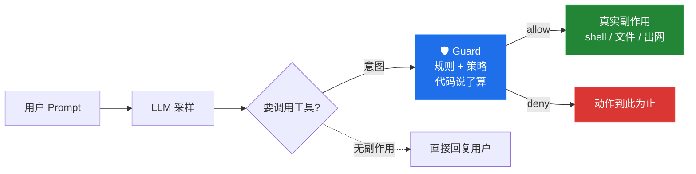
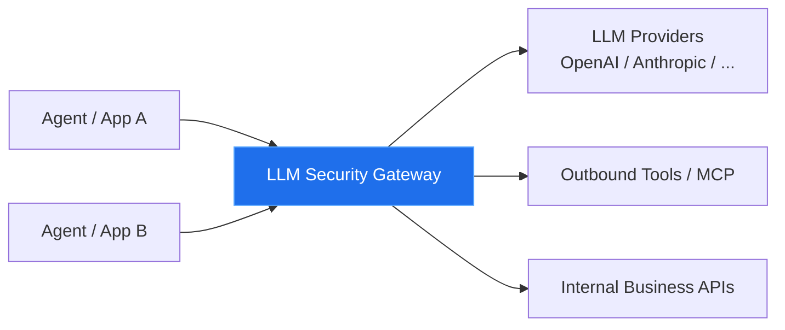
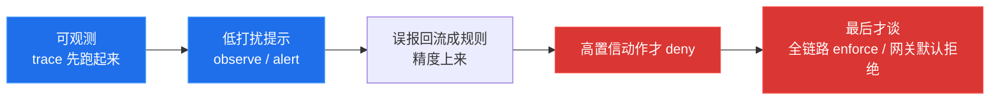

最近AI红队是越做越多了，有一半时间在想怎么打 Agent，另一半时间在想：

真要落地防护，应该长什么样（打完了，怎么防？）

我自己写过一个本地优先的 Agent Runtime Guard（ARG），也拆了下微软刚开源的 Agent Governance Toolkit（AGT）。拆完之后，判断其实挺清楚：

**Agent 运行时防护，本质上是大模型时代的"防火墙"**。说起"防火墙"这个已经被玩烂了的词，我就想笑，不过， 它确实不是又一层 prompt 话术，也不是把旧 IAM 换个名字。它卡的是「模型意图已经出来、副作用还没发生」那一截——命令还没 exec、密钥还没读、邮件还没发、HTTP 还没出网。

下图就是我们要盯的位置：不是 LLM 内部说了什么，而是它**正要动手的那个 tool call**。



保守估计，这会是未来几年最值钱的一类安全问题。不是因为概念新，而是因为 Agent 正在把「说了什么」变成「做了什么」，而我们现有的安全栈，大多还活在请求-响应时代。

---

## 为什么模型自己护不住自己

微软在 AGT 的 README 里把话说得很硬：prompt 级安全不是 control surface，只是对随机系统说了句客气话，能提升 UX（用户体验），但不怎么改变安全 ROI。OWASP LLM01 也写明——prompt injection 没有 银弹解法。他们引用的红队数字更直接：在自适应攻击下，ASR 可以打到 100%。

说人话就是：**你不能让一个横冲直撞的实习生，自己当自己的警察。**

大模型生成，本质是一种采样。

今天遵守规则，明天换个上下文、换个后缀优化、换一段网页里的二阶注入，它就可能把 `总结这篇文章` 做成 `curl | bash`。


指望 system prompt 或「请忽略恶意指令」挡住这类事，等于把必须靠谱的活儿，交给了一个靠采样碰运气的组件。

所以现有框架的共同动作，其实是同一件事——把「不确定」挪出模型，变成可判定的确定机制：

1. 把动作从自然语言里**抽出来**，变成结构：tool name、args、resource、actor、session。
2. 用**语义层规则**（YAML / JSON / Rego / Cedar）描述允许与拒绝。
3. 在副作用发生前**用代码拦死**——allow / deny / alert / require_approval，而不是「模型再想想」。

AGT 的原话是：策略内核拒绝的动作，不是「不太可能发生」，而是 **structurally impossible，结构上不可能发生**。ARG 没喊这么重的口号，但路径一样：`context → action → object → decision`，规则只出推荐，策略层决定是否强制。

说穿了：这件事指望不上模型——靠不靠谱，全看它外面那层代码够不够硬。

---

## 两条接入路线，不是同一种改造成本

落地时你会反复撞到一个选型：Guard 挂哪。先给结论，再展开。

| | Tool Call 包装器 | 大模型安全网关 |
|---|---|---|
| 拦哪 | 进程内，工具执行前 | 模型调用链统一入口 |
| 上下文 | 最全（prompt + args + 本机状态） | 偏弱（常见 prompt/API，本机副作用看不见） |
| 侵入性 | 高（每 tool/框架/客户端都要适配） | 低（改 base URL / SDK 初始化级） |
| 端侧覆盖 | 强（YOLO 模式也能拦） | 弱（危险动作可能不走网关） |
| 改造面 | 随语言/框架数量指数涨，case by case | 集中，标准化好 |
| 我的定位 | **动作层的最后一公里** | **企业主干默认形态** |

### 1. Tool Call 包装器

典型形态就一行：

```python
safe_tool = govern(my_tool, policy="policy.yaml")
```

或者在 Claude Code / Cursor 这类端侧 Runtime 上挂 `PreToolUse` Hook；在 Electron 产品里把所有 shell / 文件 / 网络收敛到 Main Process 的 Tool Broker，再进 Guard。

它的底气在于上下文全：who、intent、tool args、对话历史都在进程里——proxy 和 eBPF 拿不全的东西，这里天然有。能做意图-行动一致性：用户说「总结文章」，模型却要 `rm -rf`，这在 dispatch 点一眼可见。端侧 Agent 的真实风险面（读写本机文件、跑命令、装依赖、摸 `~/.ssh`），就该卡在这里。

代价也摆在那：侵入性高。每个 tool、每个框架、每个客户端都得有 adapter（适配器）；漏一个 `run_command` 直通原始 executor，整套规则等于摆设。多语言、多框架场景下改造面会指数涨——AGT 之所以堆 5 语言 SDK 和约 20 个框架 adapter，就是在付这笔账。

### 2. 大模型安全网关

说白了，就是给所有 LLM 流量安一个「统一关卡」。不管哪个 Agent、哪个应用、哪个租户发的，只要要调模型、要出站、要跨租户，都先挤到这一个口子过一道——查策略、记审计、脱敏、限流，过了才放行到下游。



To-B 生意里这玩意儿好卖，因为它长得就像大家已经有的 API 网关 / 零信任入口，组织有肌肉记忆：业务方几乎不用改代码，最多换一下 base URL；策略、审计、租户边界能集中在一个地方运营，采购和运维都认。

但网关不是银弹。它常能看见 prompt 和 API 调用，不一定能看见本机 shell、本地文件、MCP 子进程、Electron 里那次真实的 `exec`。端侧 YOLO 模式（`bypassPermissions` / `dontAsk`）下，危险动作可能根本不经过你的中心网关。还有个老问题——中心化故障会变成全员停摆，这跟「安全组件不当 SPOF」是直接对着干的。

所以我直接说自己判断：

> 中长期，**大模型安全网关是企业级的最佳默认形态**——改造成本小、运营面清晰、适合标准化。
>
> 但端侧 Agent 的真实副作用，仍需要 Tool Call / Hook / Tool Broker 这一层兜底。**网关管「模型边界」，包装器管「动作边界」**。两者不是二选一，是不同爆炸半径（blast radius）的分工。

ARG 优先做端侧 Hook 和 Tool Broker，不是因为网关不重要，而是因为开发者机器上的 `npm install`、读 `.env`、打 metadata endpoint，往往绕得开中心策略。AGT 则更偏企业应用中间件：`govern()`、策略引擎、身份、Merkle 审计、沙箱，一整套「结构上不可能作恶」。

同一层问题，两种产品哲学。都对，看你在哪一层。

---

## 企业落地时，技术路线还不是第一优先级

技术上谁更优雅，工程师之间可以争论很久。但产线推广时，最先打死方案的通常不是漏报，是**噪音和体验**。

我先前做 SDL研发侧安全推广时，总结过一条几乎不商量的纪律：

1. **先体验，再正确。** 研发愿意用，规则才有资格变严。
2. **必须有降级通道。** dry-run、observe、一键 rollback。（安全Guard 自己挂了，把业务一起挂了？）
3. **高 TP、高精确率、零噪音是最高优先级。** 这里的 TP 不是吞吐口号，是 true positive 的可信度——拦的是真风险，不是把日常开发骂一顿。（写代码五分钟，代码告警弄半个小时？）
4. **先证明，再铺开。** 1–2 个仓库人工核验每条命中；precision 不达标，不许全员 enforce。

ARG 把这套写进了产品行为：检测与强制解耦；默认能 observe；`--observe` 一键全局回滚；allowlist 按 rule/app/environment 降级；fail-open，规则异常或超时放行并记账。AGT 走的是反路：fail-closed，策略异常当 deny，ADR 里甚至白纸黑字写明没有 fail-open 开关——这在强合规、强隔离的服务端很性感，到了端侧开发者机器上，却很容易逼人把 Guard 卸掉。

卸掉之后是什么？裸奔。比「偶尔有一点误报的纯观察模式」更离谱。

所以企业落地的顺序，我建议固定成这样，别跳步：



说白了就一句：**没有高精确率，就没有强制权。** 安全团队要是上来就 fail-closed 全拦截，看着很勇敢，三周后往往只剩绕过和投诉单。

---

## 我从两套实现里确认的几件事

### 控制面在副作用之前，不在 prompt 里

无论 AGT 的 `govern()`，还是 ARG 的 `PreToolUse` / Tool Broker，卡点都一样：模型已经决定调用工具，但工具还没产生真实影响。二阶 prompt injection 尤其如此——商品详情、网页、邮件、附件里藏的指令，最后都得落成一次 tool call。prompt 里喊「请忽略」没用；dispatcher 前判一次，有用。

### 策略即代码，是为了把不确定变成可测

JSON/YAML 规则、热加载、bench 回放 labeled 样本、precision/recall/latency——这些看着土，却是唯一能进企业变更流程的东西。模型输出不可复现；规则命中可以复现。能复现，才能审计，才能灰度，才能在误报时指着说「是这条 `rule_id` 在闹事」。

### Tracing-first，往往比「先拦再说」更值钱

很多事故不是「没拦住」，是「说不清谁、在什么上下文下干的」。`trace_id` 串起 context → action → object → decision，比一条冷冰冰的 deny 日志更能支撑应急和复盘。ARG 把这当第一原则；AGT 用 Merkle 链和签名 TRACE，把审计做成可验证证据。深度不同，方向一致：没有执行链，运行时防护只是个黑盒开关。

### 哲学分歧值得保留，不必强行统一

| | ARG 路线 | AGT 路线 |
|---|---|---|
| 默认姿态 | fail-open，先观察 | fail-closed，默认拒绝 |
| 部署重心 | 端侧、零依赖、本地闭环 | 企业多语言、身份、沙箱、合规映射 |
| 卖点 | 灰度不可能停摆 | 结构上不可能作恶 |
| 风险 | 漏报窗口 | 误伤逼停用 |

我更倾向在**端侧和推广早期**站 ARG 这侧——安全组件不当单点故障。到了**强隔离生产 Agent、高合规租户**，AGT 那套 fail-closed + 身份 + 审计链更站得住。企业里常见的正确答案，其实是分层：网关和关键生产链路偏严格，开发者本机和试点阶段偏观察。

---

## 所以你会怎么做

如果你在建 Agent 产品或企业 Agent 平台，三件事优先级最高：

1. **先把动作收敛到可拦截边界。** 别让模型输出直接进原始 shell / 文件 / 网络执行器。没有统一 dispatcher，后面所有策略都是戏。
2. **规则与强制拆开。** 规则负责推荐，策略负责是否 enforce；必须能 dry-run，必须能量化 precision，必须能一键降级。
3. **接入形态按场景选，不按口号选。** 企业统一入口优先做大模型安全网关；端侧本机 Agent、Electron 工具、YOLO 模式，老老实实做 Tool Call 包装或 Hook。网关是未来主干，包装器是动作层的最后一公里。

Agent 运行时防护会不会短期被讲烂？会。会不会因此不重要？不会。

防火墙当年也不是因为「概念优雅」赢的，是因为流量已经不受应用自己控制，必须在边界上长出一道能拦得住的闸门。今天的 Agent，不过是把边界从 IP/端口，推到了 tool call 和模型网关。

闸门会在这两层长出来。早承认这一点的人，少交一点学费。

---

## 附录：两份可展开技术讲解

正文只讲判断。若你要对照实现细节，下面两份独立 HTML 可展开预览，也可单独打开整页读。

### 附录 A · 微软 AGT

- 独立页面：[打开 AGT 讲解](/appendices/agent-runtime/AGT_讲解.html)
- 内容：`govern()` 拦截点、fail-closed、策略/身份/沙箱/审计、OWASP 映射与边界

<details>
<summary><strong>在本页展开 · AGT 讲解</strong>（加载完整 HTML，较重时可直接点上方链接）</summary>

<div style="margin:12px 0 4px;border:1px solid var(--border, rgba(0,0,0,.12));border-radius:10px;overflow:hidden">
<iframe src="/appendices/agent-runtime/AGT_讲解.html" title="微软 Agent Governance Toolkit 技术讲解" loading="lazy" style="width:100%;height:min(78vh,820px);border:0;display:block;background:#0d1117"></iframe>
</div>

</details>

### 附录 B · 自研 ARG

- 独立页面：[打开 ARG 讲解](/appendices/agent-runtime/ARG_讲解.html)
- 内容：事件链路、fail-open 灰度、规则/策略解耦、端侧 Hook / Tool Broker、与 AGT 对照

<details>
<summary><strong>在本页展开 · ARG 讲解</strong>（加载完整 HTML，较重时可直接点上方链接）</summary>

<div style="margin:12px 0 4px;border:1px solid var(--border, rgba(0,0,0,.12));border-radius:10px;overflow:hidden">
<iframe src="/appendices/agent-runtime/ARG_讲解.html" title="Agent Runtime Guard 技术讲解" loading="lazy" style="width:100%;height:min(78vh,820px);border:0;display:block;background:#0d1117"></iframe>
</div>

</details>
