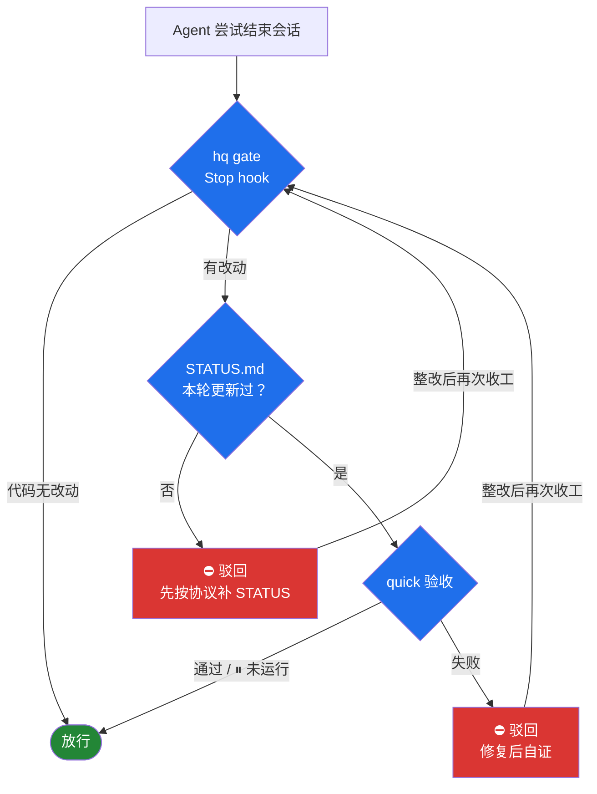

翻了过去几个月和 agent 的对话记录，有个发现挺扎心的。

我对着它们发过几十次 "go on"——不是因为它做完了，而是因为它停了。

还有几十次 "作为专家 review 一下"、"try harder"——不是因为它不行，而是因为没有任何东西替它自证。

我用的已经是目前能买到的最顶尖的 AI。而我管理它们的方式，是只要一有空，就去检查它们有没有在摸鱼。

这很可笑。后来我想明白了：问题不在模型，在于模型和项目之间缺一层协议。"我完成了"这句话，在没有验证之前就是一句空话；而我本该只处理真正需要人拍板的事，现实里却在当全时段监工。

所以我写了 [hq](https://github.com/hi-unc1e/hq)——一个跑在终端里的跨项目看板 + agent 验收脚手架。Python 3.11+，零第三方依赖，MIT，今天开源。

本地我已经把所有在跑的项目接了进去，早晚两份简报由定时任务自动生成，用下来……顺手。这篇文章讲三件事：它解决什么问题、协议长什么样、以及我最喜欢的那个部分——Stop 闸门。

先把疼痛说具体。并行跑几个项目、十来个会话之后，问题非常清晰：

- **声称完成 ≠ 完成**：agent 汇报得很漂亮，测试是不是真的绿，没人知道
- **决定会蒸发**：这个会话拍过板「不做多用户」，三天后另一个会话又来问一遍
- **看盘成本爆炸**：分不清哪件事真的在等我、哪件它自己就能推进
- **收工没有关卡**：会话一结束什么都留不下——没验证、没留痕、没下文

这四件事有个共同点：都该由机制解决，而不是靠我勤快。

## 协议：三份文件

hq 不往你的项目里塞框架。每个接入的项目只持有三份 Markdown 文件，它们构成 agent 和你之间的全部接口：

| 文件 | 谁写 | 作用 |
|---|---|---|
| STATUS.md | agent | 一句话现状、待你判断的 ❓、阻塞 ⛔、下一步 ▶ |
| ACCEPTANCE.md | 你 + agent | 「完成的定义」+ 机器检查（quick / full 两档命令） |
| DECISIONS.md | agent 代记 | 你确认过的取舍，防止同一个问题被反复问 |

核心思想一句话：**机器能证明的交给机器**。测试、指纹、复核，全部写成 ACCEPTANCE 里的检查命令；只有机器验证不了的判断——审美、取舍、授权——才以 ❓ 的形式升给你。

quick / full 分档是被现实教育出来的：quick 控制在一分钟内，每轮收工都跑；构建、e2e、全量套件放 full，留给关键节点。还有一种情况是检查因为外部条件跑不了（额度、账号、设备），脚本以 `exit 3` 退出，表示「⏸ 未运行」——不算过、也不算挂。把这类情况硬掰成非黑即白，只会让人开始无视验收结果。

机器检查跑起来是这样（真实输出，quick 档两项共 1.7 秒；路径已脱敏）：


*`hq verify --tier quick`：lint ✅ 0.1s + 信号契约 ✅ 1.6s，2/2 通过*

## 看盘与答复：五条命令

CLI 只留了五个人工命令，机器命令在 `--help` 里单独分组，不会混进日常视野。

真实看板长这样——五个项目各一行，谁在等你拍板一眼扫完（其余项目已匿名）：


*真实看板（本机截图，其余项目已匿名）*

看盘——站在项目里，只看这个项目（下面的演示用虚构项目 demo-api，数据是模拟的）：

```bash
$ cd ~/code/demo-api && hq todo
❓ demo-api#1  错误响应要不要带 request_id
❓ demo-api#2  404 页面用 illustrations 库还是纯文字
```

看某条的完整细节。agent 必须写清「怎么验 / 预期 / 建议」三件事，才有资格进 ❓ 队列：

```bash
$ hq todo 1
❓ demo-api#1 · 错误响应要不要带 request_id   [待答]
   demo-api（工具 · 自用） · 更新 2026-09-27 10:00
   现状: v0.3 缓存层上线，P95 从 810ms 降到 240ms；404 页面还没做。

   怎么验：看一眼 v0.3 的错误示例，判断排障时是否真用得上
   预期：带上后用户报障能直接给定位线索
   建议：做，成本半行代码

   文件: /code/demo-api/STATUS.md（❓ 第 15 行附近）
   答复: hq ok 1   或   hq note 1 "你的意见"
```

答复是一条命令的事，写回文件，agent 下一轮自动消化：

```bash
$ hq ok 1
✅ - [x] **错误响应要不要带 request_id** — 怎么验：看一眼 v0.3 的错误示例 …
$ hq note 2 "用 illustrations 库，但只在 404 一处用，按需加载"
💬 - [ ] **404 页面用 illustrations 库还是纯文字** — … → Henry: 用 illustrations 库，但只在 404 一处用，按需加载
$ hq todo
没有待你判断的条目。（--all 查看全部项目）
```

`hq status` 一行一个项目看全貌；`hq brief` 生成早/晚报——待判断、验收异常、空转提醒各占一节。简报本身是 Markdown，在编辑器里直接勾选、在条目后写「——你的意见」，下次生成前会自动写回 STATUS。我自己挂了两个定时任务，早 06:06、晚 21:05。从那以后，「今天各项目什么情况」这个问题，我再也没手动问过。

## Stop 闸门：agent 想收工，先过机器这一关

这是整个项目里我最喜欢的部分。

Claude Code 和 Codex 都支持 Stop hook：agent 每次想结束回合，hook 会收到一段带会话信息的 JSON，可以选择驳回，并告诉它为什么被驳回。hq gate 就挂在这个位置：



规则说人话就是三条：

1. 代码有改动，但 STATUS 没更新 → 驳回。理由直接写在驳回消息里：更新 front matter 的 `updated`、给一句话现状（结果，不是过程）、❓ 只放机器验证不了的事；
2. quick 验收没过 → 驳回，检查输出的尾部和日志路径一并附上；
3. 同一轮最多驳回两次，第三次起直接放行并在事件日志里记 `gave-up`（`<项目>/.hq/gate.log`）。防死循环的优先级高于防摆烂。

还有一个我认为最重要的设计：**闸门 fail-open**。hq 自己崩溃、超时、环境异常时，一律放行。验收工具不能变成新的单点故障——它是闸门，不是狱门。

本机真实触发的一次拦截与放行（agent 补完 STATUS 后第二次尝试即通过；路径已脱敏）：


*block 附协议理由 → 整改 → `{}` 放行*

效果就是我想要的分工：agent 想带着没验证的改动收工，机器直接把它拦回去；能证明的自己证明，证明不了的写成 ❓ 留给我。而我，只需要处理 ❓。

## 边界，以及诚实的那部分

- hq 是给**单人、多项目**（建议 5 个以内）的场景设计的。多人审批流、团队协作没做，短期也不打算做
- ✅ 机器区只由 `hq verify` 生成，手写不算证据——协议里写死了这条
- 个人数据与机制分离：登记表 hq.toml、决定、品味库全部 gitignore，开源仓库里只有机制本身
- 项目很新。我自己每天在用，本地体验不错，但 sharp edges 一定还有，欢迎来提 issue

装上试试：

```bash
git clone https://github.com/hi-unc1e/hq && cd hq
cp hq.toml.example hq.toml   # 登记你自己的项目（个人数据，已被 .gitignore 排除）
ln -s "$PWD/bin/hq" ~/bin/hq # 或任何 PATH 目录；需要 Python 3.11+
hq doctor                    # 自检
```

`hq init <路径>` 接入项目，会自动把 Stop 闸门装进 `.claude/settings.json` 和 `.codex/hooks.json`。完整协议在仓库的 `protocol/PROTOCOL.md`。

写完 hq 之后，我最大的变化不是省了几十条消息，而是我终于可以只在真正需要我判断的时刻出现了。

机器能证明的交给机器，剩下的才值得我看一眼。
